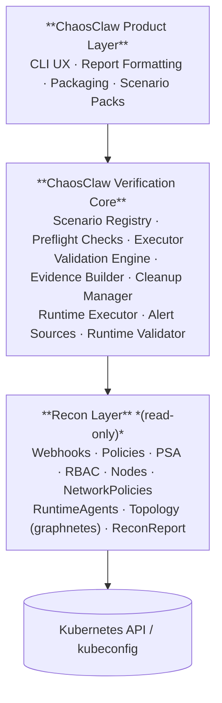

# ChaosClaw

ChaosClaw is a safe, namespace-scoped execution environment for Kubernetes security verification. It proves whether your Kubernetes guardrails actually work — not just whether they are configured — and serves as the controlled execution sandbox for OpenClaw-driven pentesting.

## What it does

ChaosClaw connects to a Kubernetes cluster and executes security verification tests inside a dedicated, RBAC-enforced test namespace. It cannot touch any other namespace in the cluster — this is enforced at the Kubernetes permission level, not just by convention.

Tests can be driven two ways:

- **Built-in scenario packs** — pre-built deterministic scenarios for common preventive and runtime controls (optional)
- **Execution primitives** — four composable primitives (`exec`, `network`, `identity`, `detect`) that OpenClaw uses to drive free-form pentesting; OpenClaw generates all inputs dynamically based on recon findings

Results are one of four outcomes: `PASS`, `FAIL`, `ERROR`, or `SKIPPED`. Every run produces a structured JSON artifact as evidence.

## Quick start

```bash
# Survey the cluster before running any tests
chaosclaw recon init
chaosclaw recon all --output recon.json

# Map cluster resource topology (requires graphnetes on PATH)
chaosclaw recon topology --namespace default

# Check that the cluster is ready for verification
chaosclaw verify preflight

# Run the preventive baseline pack
chaosclaw verify run --pack preventive-baseline

# Or drive free-form tests via execution primitives (used by OpenClaw)
chaosclaw verify exec --pod ./probe.yaml --run "cat /etc/shadow" --expect failed
chaosclaw verify run --manifest ./my-pod.yaml --expect rejected
```

## Commands

### Reconnaissance

Survey the cluster's security posture before submitting any test workloads. All recon tools are read-only. A single tool failure never aborts the survey.

```bash
# Initialize test namespace with RBAC scoping and ResourceQuota
chaosclaw recon init

# Run all survey tools and write a ReconReport
chaosclaw recon all --output recon.json

# Individual survey tools
chaosclaw recon webhooks           # fail-open webhook detection
chaosclaw recon policies           # Kyverno / Gatekeeper probe, audit-mode detection
chaosclaw recon psa                # Pod Security Admission labels per namespace
chaosclaw recon rbac               # cluster-admin bindings, high-privilege service accounts
chaosclaw recon nodes              # kernel versions, container runtimes, AppArmor presence
chaosclaw recon network-policies   # per-namespace network segmentation gaps
chaosclaw recon runtime-agents     # detect Falco, KubeArmor, Tetragon, Tracee
chaosclaw recon topology           # resource topology graph: ingress paths, secret mounts, SA bindings (requires graphnetes)
```

### Cluster readiness

```bash
chaosclaw verify preflight
chaosclaw verify preflight --context prod-us-east
chaosclaw verify preflight --output json
```

### Verification — manifest admission

```bash
# Built-in scenario packs
chaosclaw verify run --pack preventive-baseline
chaosclaw verify run --pack runtime-baseline --alert-source falco
chaosclaw verify run --scenario deny-privileged-container
chaosclaw verify run --pack preventive-baseline --context prod-us-east
chaosclaw verify run --pack preventive-baseline --output result.json

# Arbitrary manifest (primary interface for OpenClaw)
chaosclaw verify run --manifest ./my-pod.yaml --expect rejected
chaosclaw verify run --manifest ./my-deployment.yaml --expect allowed
```

### Verification — execution primitives

These four primitives are the core interface for OpenClaw-driven pentesting. OpenClaw generates all manifests and commands dynamically from recon findings.

```bash
# exec — create a pod, run a command inside it, capture exit code + stdout + stderr
chaosclaw verify exec \
  --pod ./probe.yaml \
  --run "cat /var/run/secrets/kubernetes.io/serviceaccount/token" \
  --expect succeeded \
  --alert-source falco

# network — probe a target from inside a pod
chaosclaw verify network \
  --from ./net-probe.yaml \
  --target http://169.254.169.254/latest/meta-data/ \
  --expect unreachable

# identity — test what a service account is actually allowed to do
chaosclaw verify identity \
  --as default \
  --can list \
  --resource secrets \
  --resource-namespace kube-system \
  --expect denied

# detect — exec a threat command and poll a runtime tool for a correlated alert
chaosclaw verify detect \
  --pod ./escape-probe.yaml \
  --run "nsenter --mount=/proc/1/ns/mnt -- cat /etc/shadow" \
  --expect alert_fired \
  --alert-source falco \
  --observation-window 15
```

### Scenario discovery

```bash
chaosclaw scenarios list
chaosclaw scenarios list --pack preventive-baseline
chaosclaw scenarios show deny-privileged-container
```

### Other

```bash
chaosclaw version
chaosclaw help
```

## Flags

| Flag | Description |
|---|---|
| `--context <name>` | Kubernetes context to use |
| `--kubeconfig <path>` | kubeconfig path override |
| `--namespace <name>` | Test namespace override (default: `chaosclaw`) |
| `--output <path>` | Write JSON evidence artifact to file |
| `--format <table\|json>` | Output mode |
| `--verbose` | Include extra diagnostic detail |
| `--quiet` | Minimal terminal output |
| `--no-color` | Disable colorized output |
| `--pack <id>` | Scenario pack to run |
| `--scenario <id>` | Single scenario to run |
| `--manifest <path>` | Manifest to submit (`verify run`) |
| `--expect <outcome>` | Expected outcome for the test |
| `--pod <path>` | Pod manifest (`verify exec`, `verify detect`) |
| `--run "<cmd>"` | Command to exec inside the container |
| `--container <name>` | Container to exec into (default: first) |
| `--from <path>` | Source pod manifest (`verify network`) |
| `--target <url\|host:port>` | Probe target (`verify network`) |
| `--protocol <http\|https\|tcp>` | Network protocol (default: inferred) |
| `--as <sa-name>` | Service account to test (`verify identity`) |
| `--can <verb>` | RBAC verb to test (`verify identity`) |
| `--resource <resource>` | Kubernetes resource to test (`verify identity`) |
| `--resource-namespace <ns>` | Namespace for the permission check |
| `--graph <path>` | Path to an existing `graphnetes-out/graph.json` — skips the build step (`recon topology`) |
| `--alert-source <tool>` | Runtime alert source: `none`, `falco`, `tetragon`, `kubearmor` |
| `--observation-window <s>` | Seconds to poll for a runtime alert (default: 10) |
| `--pod-timeout <s>` | Max wait for pod to reach Running (default: 60) |
| `--exec-timeout <s>` | Max time for exec command (default: 30) |
| `--connect-timeout <s>` | TCP connect timeout for network probe (default: 5) |
| `--timeout <duration>` | Per-run timeout |
| `--fail-fast` | Stop after first failed scenario |
| `--cleanup <always\|on-success>` | Cleanup mode (default: `always`) |

## Scenarios

### Preventive baseline: `preventive-baseline`

| Scenario | Control Objective |
|---|---|
| `deny-privileged-container` | Prevent privileged workloads |
| `deny-unapproved-registry` | Restrict disallowed image registries |
| `deny-hostpath` | Prevent hostPath volume usage |
| `deny-forbidden-capabilities` | Restrict dangerous Linux capabilities |
| `deny-latest-tag` | Prevent mutable image tags |
| `deny-privilege-escalation` | Prevent `allowPrivilegeEscalation: true` |
| `deny-host-network` | Prevent host network access |

### Runtime baseline: `runtime-baseline`

| Scenario | What it tests |
|---|---|
| `detect-read-sensitive-file` | Runtime tool detects read of `/etc/shadow` |

Use `--alert-source <tool>` to specify which runtime security tool to poll. Use `--alert-source none` for pipeline testing without a live tool.

## Terminal output

### Reconnaissance

```text
$ chaosclaw recon all --context prod-us-east --output recon.json

ChaosClaw Recon Survey
Cluster Context: prod-us-east
Namespace: chaosclaw

  [HIGH]  webhooks     1 fail-open webhook detected
  [WARN]  policies     Kyverno present, 2 rules in audit mode
  [OK]    psa          All non-system namespaces enforce baseline
  [HIGH]  rbac         3 cluster-admin bindings found
  [OK]    nodes        4 nodes, containerd 1.7, AppArmor enabled
  [HIGH]  network-policies  12 namespaces have no network policy
  [OK]    runtime-agents    Falco detected (DaemonSet running)
  [WARN]  topology          3 Pod→Secret mounts detected

Severity: [HIGH]
ReconReport written to: recon.json
```

### Preflight

```text
$ chaosclaw verify preflight --context prod-us-east

ChaosClaw Preflight
Cluster Context: prod-us-east
Test Namespace: chaosclaw

Checks
  [PASS] Cluster reachable
  [PASS] Authentication valid
  [PASS] Namespace creation allowed
  [PASS] Pod create/delete permissions available
  [PASS] Cleanup permissions available
  [PASS] Baseline preventive scenarios supported

Result
  Preflight passed

Next
  chaosclaw verify run --pack preventive-baseline --context prod-us-east
```

### Verification run

```text
$ chaosclaw verify run --pack preventive-baseline --context prod-us-east --output result.json

ChaosClaw Verification Run
Cluster Context: prod-us-east
Scenario Pack: preventive-baseline
Scenarios: 7
Test Namespace: chaosclaw
Cleanup: always

Running Scenarios
  [PASS] deny-privileged-container
  [PASS] deny-unapproved-registry
  [FAIL] deny-hostpath
  [PASS] deny-forbidden-capabilities
  [PASS] deny-latest-tag
  [PASS] deny-privilege-escalation
  [PASS] deny-host-network

Summary
  Pass:    6
  Fail:    1
  Error:   0
  Skipped: 0

Failed Scenarios

  deny-hostpath
    Expected: admission rejected
    Observed: workload admitted
    Likely issue: hostPath restriction policy not enforced for this workload type

Artifacts
  JSON report written to: result.json

Exit Code
  1
```

## Exit codes

| Code | Meaning |
|---|---|
| `0` | All scenarios passed |
| `1` | One or more failed controls |
| `2` | Execution error |
| `3` | Preflight failure |
| `4` | Invalid CLI usage |

## JSON output

Every run produces a structured evidence artifact. Use `--output <path>` to write it to a file, or `--format json` to print it to stdout.

```json
{
  "run_id": "uuid",
  "cluster_context": "prod-us-east",
  "pack_id": "preventive-baseline",
  "pack_version": "1",
  "started_at": "timestamp",
  "ended_at": "timestamp",
  "summary": {
    "pass": 6,
    "fail": 1,
    "error": 0,
    "skipped": 0
  },
  "results": [...]
}
```

The `recon all` command produces a `ReconReport`:

```json
{
  "runId": "uuid",
  "clusterContext": "prod-us-east",
  "namespace": "chaosclaw",
  "startedAt": "timestamp",
  "endedAt": "timestamp",
  "summary": { "critical": 0, "high": 3, "warn": 1, "ok": 3 },
  "tools": [...]
}
```

## Safety model

ChaosClaw is designed to be safe to run in real clusters, including production.

- **RBAC-enforced namespace isolation** — ChaosClaw's service account is bound to the dedicated test namespace only; it structurally cannot read, write, or affect any other namespace
- All execution is confined to a dedicated test namespace (`chaosclaw` by default)
- No user workloads or application namespaces are modified
- Cleanup always runs after every test, even on failure
- Tests run sequentially, not concurrently
- Every test has an execution timeout
- A `ResourceQuota` is applied to the test namespace to bound resource usage
- All recon tools are read-only — no resources are created or modified during survey

## OpenClaw skills

ChaosClaw ships two OpenClaw skills in `skills/`:

| Skill | Trigger | Description |
|---|---|---|
| `chaosclaw` ⚔️ | "Verify controls on this cluster" | Targeted control verification — recon init, preflight, scenario pack runs, result parsing, failure summarization, fleet fan-out |
| `openclaw-pentest` 🔥 | "Pentest this cluster" | Autonomous security assessment — OpenClaw runs recon first, then uses execution primitives to probe the attack surface; produces a prioritized Critical/High/Gap report |

Use `chaosclaw` when you know what you want to run. Use `openclaw-pentest` when you want OpenClaw to assess the cluster's security posture without being constrained to pre-defined scenarios.

### Register with OpenClaw

Add the skills directory to `~/.openclaw/openclaw.json`:

```json
{
  "skills": {
    "load": {
      "extraDirs": ["/path/to/chaosclaw/skills"],
      "watch": true
    },
    "entries": {
      "chaosclaw": { "enabled": true },
      "openclaw-pentest": { "enabled": true }
    }
  }
}
```

### Skill structure

Each skill follows the orchestrator + references pattern:

```
skills/
  chaosclaw/
    SKILL.md                  ← workflows and safety rules
    references/
      goal-elaboration.md     ← result vocabulary, summarization, fleet aggregation
      cli-reference.md        ← commands, JSON schema, exit codes, remediation
  openclaw-pentest/
    SKILL.md                  ← pentest workflow and authorization gate
    references/
      goal-elaboration.md     ← scope, cross-pack correlation, severity, report structure
      cli-reference.md        ← commands, exit codes, execution primitives, remediation
```

ChaosClaw owns the pass/fail verdict. The skills own the workflow, interpretation, and remediation guidance layer.

---

## Architecture

ChaosClaw is a single-cluster CLI. Its primary role is as a **safe execution sandbox**: it enforces namespace isolation via RBAC, manages cleanup, records raw Kubernetes admission and runtime outcomes, and produces structured evidence.

The recon layer surveys the cluster's security posture before any test workloads are submitted. The execution layer provides four primitives that OpenClaw composes freely. Scenario packs are optional built-ins.

OpenClaw is the optional orchestration and intelligence layer. It runs recon, interprets the findings, decides what to test, generates manifests and commands dynamically, and submits them to ChaosClaw for safe execution. ChaosClaw owns correctness and safety; OpenClaw owns what gets tested and what the results mean.



## Docs

- [Architecture](docs/architecture.md) — system design, multi-cluster model, and roadmap
- [CLI Design](docs/design.md) — UX principles, workflows, and command model
- [Screen Library](docs/cli-design.md) — canonical terminal output examples
- [Recon Layer Design](docs/recon-design.md) — reconnaissance command group, flag design, terminal output specs, and type contract
- [Execution Layer Design](docs/execution-layer-design.md) — four execution primitives, flag reference, evidence schema, and OpenClaw usage patterns
