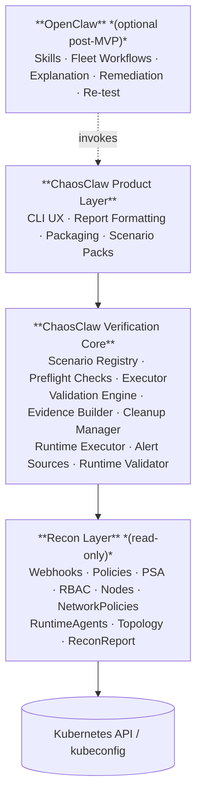

# ChaosClaw Architecture
## Single-Cluster MVP and Multi-Cluster Evolution with OpenClaw

**Version:** 0.1  
**Status:** Working architecture baseline  
**Audience:** Product, engineering, security architecture, design partners

---

## 1. Executive Summary

ChaosClaw is a **safe, namespace-scoped execution environment** for Kubernetes security verification.

The MVP focuses on one core job:

> **Prove that Kubernetes guardrails work — safely and without affecting production.**

That means the first version should:

- run against **one Kubernetes cluster at a time**
- enforce **RBAC-scoped namespace isolation** so it structurally cannot affect any other namespace
- accept tests via **built-in scenario packs** (optional) or **arbitrary manifests** supplied by the caller
- capture **raw Kubernetes/admission outcomes**
- produce **pass / fail / error / skipped** results
- write **structured evidence** to JSON
- work **without** any control plane or agent runtime

OpenClaw comes in as the **optional orchestration and intelligence layer**, not the verification engine.

Its role is to:

- decide what to test (including generating manifests dynamically for free-form pentesting)
- coordinate runs across multiple clusters
- summarize results and surface security gaps
- drive re-test workflows
- add explanation and remediation guidance
- enable future closed-loop workflows

**Key design rule:**

> **ChaosClaw owns correctness and safety. OpenClaw owns what gets tested and what the results mean.**

---

## 2. Problem the Architecture Solves

ChaosClaw is intended to validate whether Kubernetes controls are effective in real environments, not just configured.

The architecture therefore needs to support:

- deterministic validation
- safe execution
- evidence generation
- future expansion from one cluster to many
- clean separation between product logic and agentic workflows

The architecture must avoid over-building in v1 while still creating a strong path to:

- multi-cluster verification
- scheduling
- change-triggered runs
- remediation guidance
- broader control verification workflows

---

## 3. Architecture Principles

### 3.1 Deterministic before agentic
Verification correctness cannot depend on autonomous reasoning.

ChaosClaw must be able to prove whether a control passed or failed using deterministic logic.

### 3.2 Single-cluster correctness is the foundation
Fleet-wide verification is only useful if one-cluster verification is reliable, safe, and repeatable.

### 3.3 Safety is a first-class requirement
All execution must be:

- namespace-scoped
- reversible
- least-privilege
- timeout-bound
- automatically cleaned up

### 3.4 Built-in scenario packs are optional
ChaosClaw ships optional pre-built scenario packs for common preventive controls. These are convenience — not the primary interface. The primary execution path is `--manifest`, which accepts any manifest from any caller. Scenario packs are declarative and versioned, but their presence is not required for ChaosClaw to be useful.

### 3.5 OpenClaw extends workflows; it does not redefine results
OpenClaw may invoke ChaosClaw, summarize outcomes, and recommend next steps, but it should not own pass/fail semantics.

### 3.6 Namespace RBAC is the primary safety boundary
ChaosClaw's safety guarantee is not about restricting what manifests can be submitted — it is about ensuring that whatever gets submitted cannot escape the test namespace. The CLI's service account is RBAC-bound to the test namespace only. This means OpenClaw can generate and submit arbitrary manifests for free-form pentesting, and the safety guarantee holds regardless. The blast radius is enforced structurally, not by convention.

### 3.7 Evidence must remain stable as the system scales
The JSON evidence schema created by the single-cluster CLI should remain the same foundation for later multi-cluster aggregation.

---

## 4. High-Level Architecture

### 4.1 Layered model



### 4.2 Interpretation

* **ChaosClaw CLI core** is the product you ship first.
* **ChaosClaw verification core** is the source of truth for execution and validation.
* **OpenClaw** is added later as the orchestration plane for multi-cluster and workflow automation.

---

## 5. ChaosClaw Single-Cluster MVP

## 5.1 Product definition

The MVP is:

> **A CLI that connects to one Kubernetes cluster and runs preventive-control verification scenarios, then outputs structured evidence.**

This is intentionally narrow.

### In scope

* single cluster per run
* RBAC-enforced test namespace isolation
* execution via built-in scenario packs (optional) or arbitrary manifests (`--manifest`)
* on-demand execution
* deterministic outcome recording (pass/fail/error/skipped)
* terminal output
* JSON artifact output
* strict cleanup
* direct use of kubeconfig / current context

### Out of scope

* web UI
* hosted control plane
* multi-cluster orchestration
* scheduling
* remediation validation
* recovery validation
* ticketing / SIEM integration
* cluster scoring
* compliance reporting packages
* agent-required execution

---

## 5.2 Core components

### A. CLI command layer

Handles command parsing, flags, output formatting, and exit codes.

Example commands:

```bash
chaosclaw verify preflight
chaosclaw verify run --pack preventive-baseline
chaosclaw verify run --scenario deny-privileged-container
chaosclaw verify run --pack preventive-baseline --context prod-us-east --output result.json
chaosclaw scenarios list
chaosclaw scenarios show deny-hostpath
```

### B. Scenario registry

Loads built-in scenario definitions and scenario packs.

Responsibilities:

* resolve scenario IDs
* resolve pack membership
* load expected outcomes
* load cleanup metadata
* enforce versioned scenario schema

### C. Preflight engine

Validates that the target cluster is ready for execution.

Checks include:

* cluster reachable
* auth valid
* namespace creation allowed
* required permissions present
* policy prerequisites present
* target scenario pack supported

### D. Scenario executor

Applies the test manifest or action to the cluster and captures raw results.

Responsibilities:

* create or reuse test namespace
* apply manifest
* observe Kubernetes API response
* observe admission rejection or allow
* record execution timing
* inventory created resources

### E. Validation engine

Determines:

* `Pass`
* `Fail`
* `Error`
* `Skipped`

This is the most important deterministic layer in the system.

### F. Evidence builder

Creates:

* terminal summary
* per-scenario detail
* JSON evidence artifact

For the evidence JSON schema, see [execution-layer-design.md](execution-layer-design.md).

### G. Cleanup manager

Ensures:

* all created resources are deleted
* cleanup status is recorded
* cleanup happens even after failed scenarios where possible

---

## 5.3 MVP execution flow

```text
1. User runs ChaosClaw CLI.
2. CLI resolves kube context and selected scenario pack.
3. Preflight checks verify safety and prerequisites.
4. CLI creates scoped test namespace.
5. Scenarios execute sequentially.
6. Kubernetes admission allows or rejects each action.
7. ChaosClaw captures raw outcome.
8. Validation engine computes Pass / Fail / Error / Skipped.
9. Cleanup manager removes created artifacts.
10. Evidence builder writes JSON and terminal summary.
```

---

## 5.4 MVP baseline scenarios

Start with 5–7 deterministic preventive scenarios.

### Recommended first pack: `preventive-baseline`

1. **Privileged container denied**
2. **Unapproved registry denied**
3. **hostPath mount denied**
4. **Forbidden Linux capabilities denied**
5. **Latest tag denied**

Optional additions:

6. **Host network denied**
7. **Required labels enforced**

### Selection criteria

Every MVP scenario must be:

* deterministic
* safe to execute
* simple to clean up
* easy to explain
* directly tied to preventive guardrails
* valuable to platform and security teams

For the full scenario catalog including per-scenario details and remediation guidance, see [scenarios.md](scenarios.md).

---

## 6. Safety Model

Safety is non-negotiable.

## 6.1 Safety controls

### Dedicated test namespace

All execution occurs in a dedicated ChaosClaw test namespace.

### Least-privilege access

The CLI should operate with only the permissions required for baseline scenarios.

### No mutation of customer workloads

MVP must not modify user workloads or application namespaces.

### Sequential execution

Run one scenario at a time in MVP.

### Timeouts

Each scenario has a maximum execution window.

### Cleanup guarantees

Cleanup should always be attempted, regardless of scenario result.

### Resource quotas

The test namespace should use conservative limits where possible.

### Auditability

Every run should record:

* cluster context
* selected scenarios
* timestamps
* manifest snapshot
* cleanup result
* raw API outcomes

---

## 7. OpenClaw Agent Layer

OpenClaw is **optional** in MVP and becomes important when the product expands to multi-cluster workflows.

## 7.1 Role of OpenClaw

OpenClaw should provide:

* deciding what to test — including generating manifests dynamically for free-form pentesting
* orchestration and skill-based invocation
* explanation and remediation guidance
* workflow routing
* summarization and gap analysis
* fleet fan-out
* re-test flows

It should **not** provide:

* the core validation logic
* the source of truth for pass/fail
* safety guarantees (those belong to ChaosClaw's RBAC enforcement)

---

## 7.2 Entity ownership

| Entity            | Owned by   | Purpose                                                |
| ----------------- | ---------- | ------------------------------------------------------ |
| Scenario          | ChaosClaw  | Optional pre-built test                                |
| Scenario Pack     | ChaosClaw  | Optional group of pre-built tests                      |
| Manifest          | OpenClaw   | Dynamically generated test input                       |
| Execution sandbox | ChaosClaw  | Safe, RBAC-scoped execution and outcome recording      |
| Skill             | OpenClaw   | Invokes ChaosClaw and adds workflow and analysis layer |

---

## 8. Multi-Cluster Architecture Using OpenClaw

## 8.1 Design rule

> **ChaosClaw remains single-cluster per execution. OpenClaw scales it horizontally across many clusters.**

This keeps the verification engine simple and reusable.

---

## 8.2 Multi-cluster logical architecture

```text
+---------------------------------------------------------------+
|                    OpenClaw Orchestrator                      |
|---------------------------------------------------------------|
| Fleet skill router | inventory | scheduling | summarization   |
+---------------------+--------------------+--------------------+
                      |                    |
          invokes ChaosClaw CLI     invokes ChaosClaw CLI
                      |                    |
             +--------v--------+  +--------v--------+
             | Cluster A run   |  | Cluster B run   |
             +-----------------+  +-----------------+
                      |                    |
                JSON evidence         JSON evidence
                      +--------+  +--------+
                               v  v
                    Fleet aggregation and follow-up
```

---

## 8.3 Orchestration recommendation

Start with a **single orchestrator agent** — one OpenClaw skill loops through the full target inventory. This is the simplest implementation and appropriate for small design-partner fleets.

Migrate to **one agent per cluster or environment group** as isolation requirements and scale increase.

---

## 8.4 Fleet workflow

```text
1. User asks OpenClaw to verify a fleet.
2. OpenClaw resolves the target list.
3. OpenClaw selects the scenario pack and concurrency policy.
4. For each cluster, OpenClaw invokes ChaosClaw CLI with the correct context.
5. Each run produces an independent JSON artifact.
6. OpenClaw aggregates results.
7. OpenClaw highlights failed controls and patterns.
8. Optional remediation and re-test workflows begin.
```

---

## 8.5 Cluster inventory model

Use a flat YAML file listing clusters and tags. This is explicit, portable, and sufficient for all early use cases.

```yaml
clusters:
  - name: prod-us-east
    context: prod-us-east
    environment: prod
    region: us-east
  - name: prod-us-west
    context: prod-us-west
    environment: prod
    region: us-west
  - name: staging
    context: staging
    environment: staging
    region: us-east
```

---

## 8.6 Aggregation model

OpenClaw should aggregate ChaosClaw outputs, not replace them.

### Per-cluster output remains:

* one ChaosClaw JSON artifact
* one deterministic result set
* one cluster-scoped source of truth

### Fleet summary adds:

* cluster pass/fail rollup
* failed control counts by scenario
* environment-level summaries
* common failure reasons
* rerun candidate list

This keeps aggregation downstream from the same core evidence model.

---

## 9. Ownership Boundaries

## 9.1 Owned by ChaosClaw

* optional built-in scenario definitions and pack definitions
* CLI contract
* preflight logic
* RBAC-enforced namespace isolation (the primary safety boundary)
* execution logic (accepts scenarios or arbitrary manifests)
* validation semantics (pass/fail/error/skipped)
* cleanup logic
* JSON evidence schema
* single-cluster safety guarantees

## 9.2 Owned by OpenClaw

* deciding what to test (scenario selection or dynamic manifest generation)
* skill execution
* workflow routing
* cluster fan-out
* context isolation strategy
* scheduling later
* explanation and gap analysis
* remediation guidance
* re-test coordination
* fleet summarization

## 9.3 Shared contract

The stable interface between the two should be:

* CLI flags
* scenario IDs
* pack IDs
* exit codes
* JSON schema
* version compatibility rules

---

## 10. API / Interface Philosophy

Even if MVP is CLI-only, design the interface as if it will become a stable programmable contract.

### This means:

* clear flags
* clear exit codes
* versioned JSON schema
* predictable scenario IDs
* predictable pack IDs
* strong backward compatibility

### Exit code model

* `0` = all scenarios passed
* `1` = one or more failed controls
* `2` = execution error
* `3` = preflight failure
* `4` = invalid CLI usage

This makes OpenClaw orchestration straightforward later.

---

## 11. Implementation Roadmap

## Phase 1 — ChaosClaw CLI core

Deliver:

* scenario registry
* preflight checks
* executor
* validation engine
* evidence builder
* cleanup manager
* 5 baseline preventive scenarios

Exit criteria:

* one cluster can be verified reliably
* pass/fail results are trustworthy
* JSON schema is stable enough for downstream automation

## Phase 2 — Hardening and packaging

Deliver:

* stronger cleanup behavior
* stable command model
* better output formatting
* more scenario coverage
* better docs and install flow

Exit criteria:

* design partners can use the CLI without engineering hand-holding

## Phase 3 — OpenClaw multi-cluster orchestration

Deliver:

* **ChaosClaw MCP server** — exposes `chaosclaw_preflight`, `chaosclaw_run_scenario`, `chaosclaw_run_pack`, `chaosclaw_list_scenarios`, `chaosclaw_get_evidence` as structured MCP tool calls
* Bounded evidence responses with compact `summary` top-level field; full detail paged via `chaosclaw_get_evidence`
* Inventory-driven fleet skill
* Fan-out execution
* Fleet aggregation
* Failed-cluster targeting
* Rerun workflows

Exit criteria:

* Multiple clusters can be verified using the same single-cluster core
* OpenClaw can invoke ChaosClaw via MCP without subprocess orchestration

## Phase 4 — Closed-loop workflows

Deliver:

* explanation skills
* remediation suggestions
* change-triggered re-verification
* richer operational workflows

Exit criteria:

* the product supports repeat operational use, not just one-time validation

For current implementation status, see [progress.md](progress.md).

---

## 12. Recommendation

### Final recommendation

Ship **ChaosClaw first as a deterministic single-cluster CLI**.

Then use **OpenClaw as the orchestration layer** to expand the same engine into:

* multi-cluster verification
* skill-driven workflows
* fleet summaries
* remediation guidance
* re-test loops

### Architectural statement

> **ChaosClaw is the safe execution sandbox for Kubernetes security verification. OpenClaw is the optional intelligence and orchestration layer that decides what to test, drives free-form pentesting, and scales ChaosClaw across clusters and workflows.**

This gives you the cleanest path to:

* fast MVP delivery
* trustworthy verification semantics
* low architectural risk
* future multi-cluster expansion
* a coherent product story

---

## 13. Implementation Language

**Decision:** ChaosClaw is implemented in **TypeScript (Node.js ≥ 22.16.0)**.

### Rationale

ChaosClaw and OpenClaw are sibling products. OpenClaw is a TypeScript-first monorepo. This alignment provides:

* **Shared JSON schema types** — The evidence schema can be a shared TypeScript package. No translation layer, no schema drift between the two products.
* **Skill integration** — OpenClaw skills are TypeScript. ChaosClaw can be imported directly by skills as a library, not only invoked as a subprocess.
* **Tooling alignment** — Same compiler (`tsc`/`tsdown`), test runner (`vitest`), linter (`oxlint`), and package manager (`pnpm`) as OpenClaw. Reduces toolchain fragmentation across the two products.
* **Kubernetes client** — `@kubernetes/client-node` is the official Kubernetes JavaScript/TypeScript client, maintained by the Kubernetes sig-api-machinery team.

### Distribution

ChaosClaw is bundled to a single distributable using `tsdown`, aligned with OpenClaw's build pipeline. A Docker image is provided for environments without a Node.js runtime.

### Tooling stack

| Tool                        | Purpose                       |
| --------------------------- | ----------------------------- |
| TypeScript                  | Language                      |
| Node.js ≥ 22.16.0           | Runtime (aligned with OpenClaw)|
| `commander`                 | CLI argument parsing          |
| `chalk`                     | Terminal color output         |
| `@kubernetes/client-node`   | Kubernetes API client         |
| `tsdown`                    | Bundle to single distributable|
| `tsx`                       | Development runner            |
| `vitest`                    | Test framework                |
| `oxlint`                    | Linter                        |
